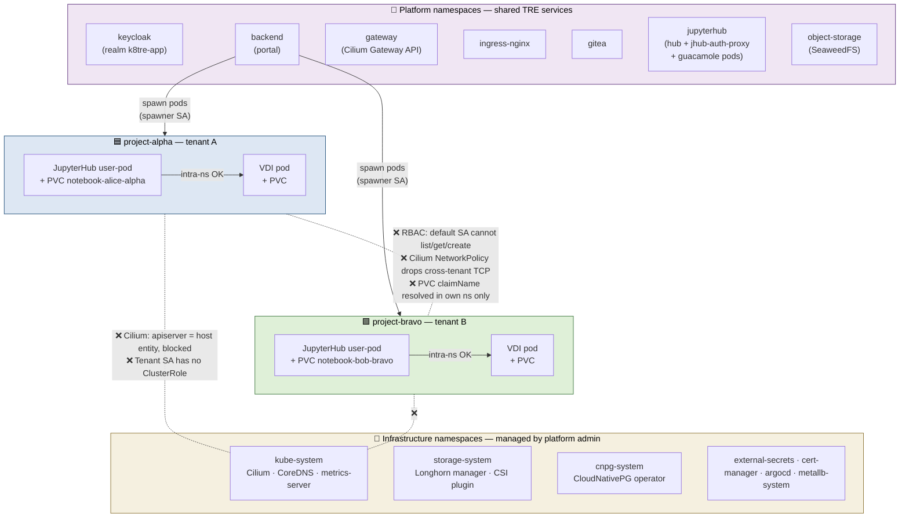
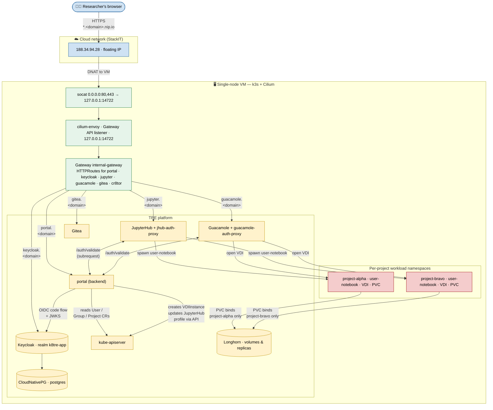

# k8tre — architecture & isolation diagrams

Two diagrams that describe the cluster as deployed on the StackIT environment (single-node k3s + Cilium + Longhorn).

1. Focuses on how project tenants are kept apart from each other and from the infrastructure.
1. Cooms out to the end-to-end request flow from a researcher's browser down to a per-project notebook pod.

## 1. Namespace separation & tenant isolation

**Reading the diagram**

- **Vertical separation**: cluster-scoped resources sit at the top
  (only platform admins write here); the row of infrastructure
  namespaces hosts the cluster operators (Cilium, Longhorn, CNPG,
  cert-manager, ArgoCD); below them the platform namespaces host the
  TRE services every tenant shares (Keycloak, portal, gateway, hub,
  Gitea, object-storage); at the bottom each project lives in its own
  `project-<name>` namespace.
- **Solid arrows** mark traffic that flows in production: the backend's
  spawner ServiceAccount creates user pods inside the project
  namespaces; pods within the same project talk freely.
- **Dashed lines** mark the four assertions
  [`tests/test-project-isolation.sh`](../tests/test-project-isolation.sh)
  enforces: cross-tenant RBAC `no`, cross-tenant network drops, cross-
  namespace `claimName` not resolved, and project pods cannot reach the
  apiserver (Cilium treats `10.43.0.1` as `host`, the
  `allow-pod-to-pod-via-gateway` policy only opens `cluster` entities).

## 2. End-to-end request flow

**Reading the diagram**

- **Ingress chain (top-left to top-right)**: browser → floating IP →
  cloud NAT → VM's `enp3s0:443` → `socat` systemd unit → Cilium-Envoy
  loopback listener → `Gateway internal-gateway` (Cilium Gateway API).
  This is the path documented in
  [`docs/troubleshooting/k8tre-install-guide.md`](troubleshooting/k8tre-install-guide.md#5-expose-the-gateway-on-the-host-ip)
  and the reason `socat` exists on the host: every HTTPS hit traverses
  it.
- **HTTPRoutes** fan out to the platform services. Three (Keycloak,
  portal, Gitea) serve directly; two (JupyterHub, Guacamole) are
  fronted by their auth-proxy nginx which calls back to
  `portal:/auth/validate` for every request to translate the user's
  Keycloak session into the per-project authorization decision.
- **portal ↔ Keycloak** is OIDC over the **internal-resolved** public
  hostname — see the CoreDNS hosts override in
  [`docs/troubleshooting/keycloak-post-install-setup.md`](troubleshooting/keycloak-post-install-setup.md#make-the-backend-reach-keycloak-from-inside-the-cluster)
  for why a pod hitting `keycloak.<domain>` is rewritten to the VM's
  primary private IP rather than hairpinning out the cloud NAT.
- **portal ↔ apiserver** is how the User → Group → Project CR graph is
  read at every `/projects` and `/auth/validate` call, and how the
  backend mints a `VDIInstance` when a researcher clicks *Launch*.
- **JupyterHub & Guacamole spawn pods inside the tenant namespace** —
  per-project PVCs are created/bound here, never across; the dotted
  isolation boundaries of Diagram 1 apply.
